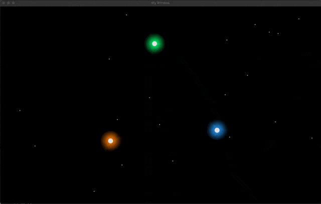
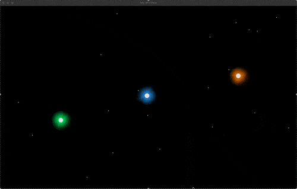
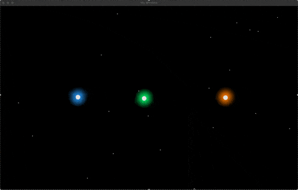

# 2D Gravity Simulator 🪽

## Demo 📸

    
    

    
    

    

## How It Works ⚙️

## Features

# Contributions

- [Periodic Planar Three-Body Orbits / Ricky Reusser | Observable](https://observablehq.com/@rreusser/periodic-planar-three-body-orbits)
- [Ben Eater](https://eater.net/boids)
- [N4G1/Slider-SFML: Simple slider made in SFML](https://github.com/N4G1/Slider-SFML)
