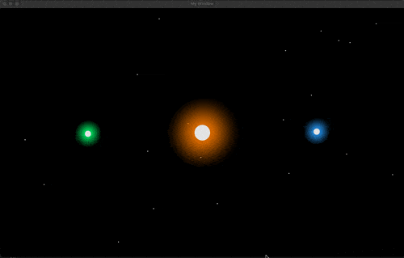

# 2D Gravity Simulator 🪽

## Overview 📌

This 2D Gravity Simulator is an interactive application that visualizes the complex dynamics of three-body gravitational systems. Leveraging the SFML library, this simulator offers real-time rendering of planetary motions, allowing users to observe and analyze various orbital patterns and behavior.

## Features

- **Real-Time Simulation:** Observe the intricate movements and interactions of three celestial bodies influenced by gravitational forces.
- **Multiple Orbit Configurations:** Explore a variety of predefined orbital setups, including:
    - Lagrange Orbit:
    - Euler's Orbit:
    - Figure 8 Orbit:
    - BroukeA3 Orbit:
    - BroukeA7 Orbit:
**Customizable Parameters:** Adjust initial conditions such as positions, velocities, and masses to create unique simulations.
**Visual Enhancements:** Utilise shaders and color blending to produce visually appealing representations of planetary trails and glows.


## Demo 📸

- **Lagrange Orbit** | **Euler's Orbit** 

<p style="display: flex; align-items:center">
    
    
</p>

- **Figure 8 Orbit** | **BroukeA7 Orbit** 

<p style="display: flex; align-items:center">
    
    
</p>

- **BroukeA3 Orbit**

<p align="center">
    
</p>


## Mac OS Setup 💻

### Prerequisites

1. Ensure You Have Git Installed
    - *Not Explaining This...*

2. Ensure You Have The **SFML Libraries** Installed:
    - Using Homebrew
        ```bash
        brew install sfml
        ```

    - Using ATP
        ```bash
        sudo apt update sudo apt install \
        libxrandr-dev \
        libxcursor-dev \
        libxi-dev \
        libudev-dev \
        libflac-dev \
        libvorbis-dev \ 
        libgl1-mesa-dev \
        libegl1-mesa-dev \
        libdrm-dev \
        libgbm-dev
        ```

    - From [official SFML website](https://www.sfml-dev.org/download/)

3. Ensure You Have The **CMake** Installed:

    - Using Homebrew
        ```bash
        brew install cmake
        ```

    - Using ATP
        ```bash
        sudo apt install cmake
        ```

### Build & Run

1. **Build The Project**:
    - In the root directory run:
        ```bash
        mkdir build
        cd build
        cmake ..
        make
        ```

2. **Run The Application**
    - Simply Execute:
        ```bash
        ./bin/main
        ```


## Usage 🔧

- Initial conditions for each orbit are setup as helper functions defined in `three-body-orbits/src/core/initialconditions.cpp` which each return unordered maps.
- These functions are called by the main function in `main.cpp` which use these maps to run the simulation.
- TL;DR is this: You can create new initial conditions in `three-body-orbits/src/core/initialconditions.cpp` by creating a new function or change alter existing ones.
- You must just be sure that your newly created function populates a map according to the already existing functions.
- If you would like to change the orbit then uncomment it in the `main.cpp` file.
Sure! Here's a clearer and more readable version of your **Usage** section:


## 🔧 Usage

- All initial conditions for different orbits are defined as helper functions in `src/core/initialconditions.cpp`. Each function returns an `unordered_map` containing the necessary setup data.

- These functions are then called in `main.cpp`, where the simulation is run using the data provided by the selected orbit.

- **Want to add your own orbit?**  
  You can create a new function in `initialconditions.cpp`, or modify an existing one. Just make sure your function fills the `unordered_map` in the same format as the others.

- To switch orbits, simply **uncomment** the one you want to use in `main.cpp`.


# Contributions

- [Periodic Planar Three-Body Orbits / Ricky Reusser | Observable](https://observablehq.com/@rreusser/periodic-planar-three-body-orbits)
- [Stable Close Orbits - Figure 8 | Faustino Palmero Ramos - University Of Edinburgh](https://www.google.com/url?sa=t&source=web&rct=j&opi=89978449&url=https://www.maths.ed.ac.uk/~ateckent/vacation_reports/Report_Faustino.pdf&ved=2ahUKEwjxwOSZzcOMAxXvRUEAHZx2HEkQFnoECBIQAQ&usg=AOvVaw2B7QA34fhdsz_3pvOdqe1r)
- [A guide to hunting periodic three-body orbits | Milovan Suvakova and V. Dmitrasinovic - Belgrade University](https://www.google.com/url?sa=t&source=web&rct=j&opi=89978449&url=http://suki.phy.bg.ac.rs/AJP_Suvakov_Dmitrasinovic.pdf&ved=2ahUKEwiojrGCzcOMAxXgV0EAHUrDH54QFnoECCwQAQ&usg=AOvVaw0SZSZDOLiSiOolEMVS5nMc)
- [SFML - Home](https://www.sfml-dev.org/)
